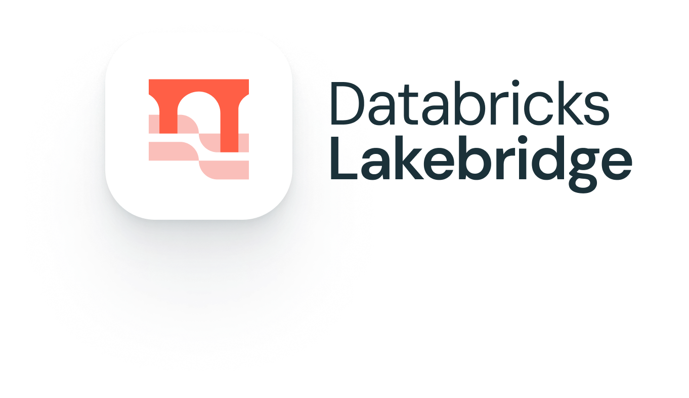
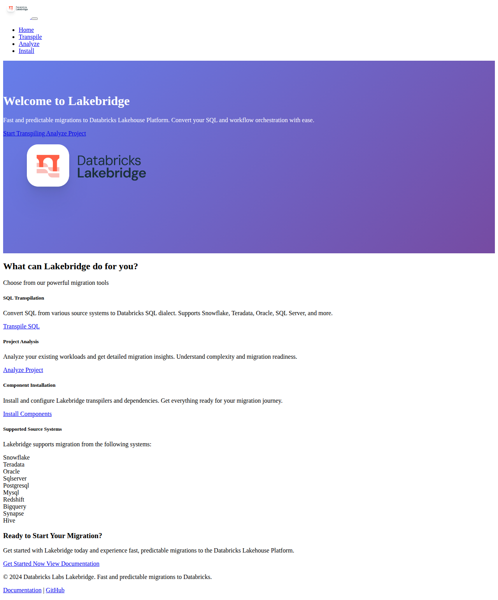
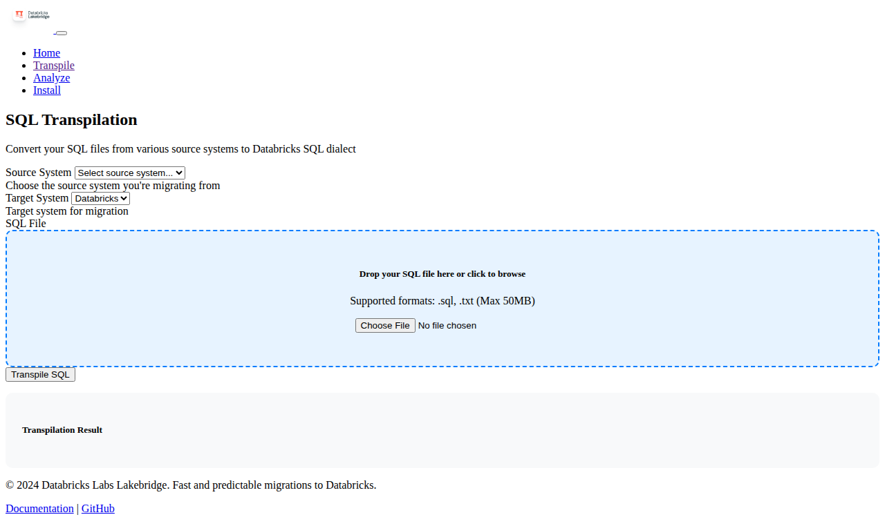
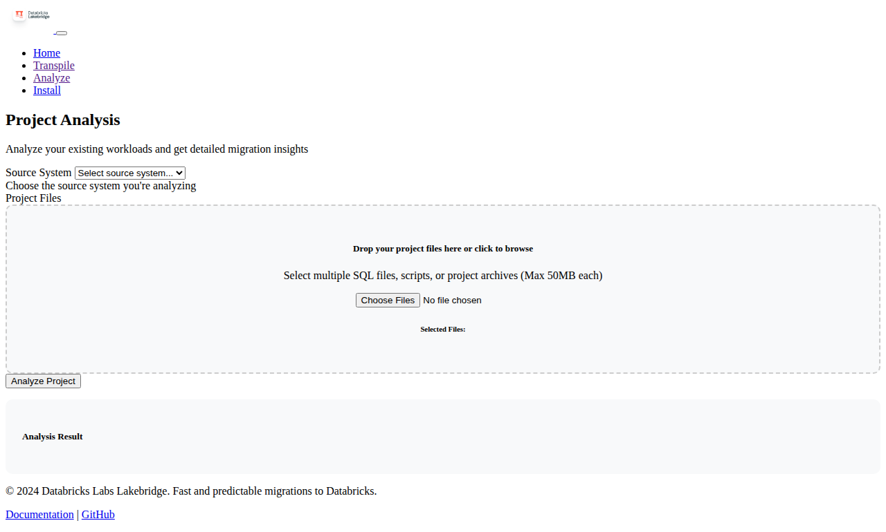

# Lakebridge Web Application



A user-friendly web interface for the Lakebridge migration tool, providing fast and predictable migrations to Databricks Lakehouse Platform. This web application makes it easier to migrate workloads to Databricks by converting SQL and workflow orchestration through an intuitive browser interface.

[](https://github.com/databrickslabs/remorph/actions/workflows/push.yml)


by [Databricks Labs](https://www.databricks.com/learn/labs)

## 🌟 Features

The Lakebridge Web Application provides a comprehensive set of migration tools through an easy-to-use web interface:

- **🔄 SQL Transpilation**: Convert SQL files from various source systems (Snowflake, Teradata, Oracle, SQL Server, etc.) to Databricks SQL dialect
- **📊 Project Analysis**: Analyze existing workloads and get detailed migration insights with comprehensive reports
- **⚙️ Component Installation**: Install and configure Lakebridge transpilers and dependencies
- **📁 File Upload Support**: Upload SQL files, scripts, and project archives with drag-and-drop functionality
- **⚡ Real-time Results**: View transpilation results and analysis reports instantly in the browser
- **💾 Download Options**: Download converted SQL files and detailed analysis reports
- **🔌 REST API**: Programmatic access to all functionality via RESTful endpoints
- **🛡️ Databricks Authentication**: Seamless integration with Databricks workspace authentication

## 🏗️ Prerequisites

Before getting started, ensure you have the following installed:

- **Python 3.10 or higher**
- **pip package manager**
- **Git** (for cloning the repository)
- **Web browser** (Chrome, Firefox, Safari, or Edge)

### Optional Prerequisites for Advanced Features

- **Databricks Account**: For authenticated operations and workspace integration
- **Databricks CLI**: For credential management (optional)

## 🚀 Quick Start

### Method 1: Complete Installation (Recommended)

1. **Clone the repository:**
   ```bash
   git clone https://github.com/murtihash94/neulakebridge.git
   cd neulakebridge
   ```

2. **Set up Python environment:**
   ```bash
   python -m venv .venv
   
   # On Windows:
   .venv\Scripts\activate
   
   # On macOS/Linux:
   source .venv/bin/activate
   ```

3. **Install the package with all dependencies:**
   ```bash
   pip install --upgrade pip
   pip install -e .
   ```

4. **Launch the web application:**
   ```bash
   cd src/databricks/labs/lakebridge/webapp
   python run_webapp.py
   ```

5. **Access the web interface:**
   Open your browser and navigate to: `http://localhost:8080`

### Method 2: Minimal Installation

If you only want to run the web application without installing the full package:

```bash
git clone https://github.com/murtihash94/neulakebridge.git
cd neulakebridge
pip install flask sqlglot databricks-sdk
cd src/databricks/labs/lakebridge/webapp
PYTHONPATH=../../../.. python app.py
```

### Method 3: Development Setup

For developers who want to contribute or modify the application:

```bash
git clone https://github.com/murtihash94/neulakebridge.git
cd neulakebridge
make dev  # This sets up the development environment
source .venv/bin/activate
cd src/databricks/labs/lakebridge/webapp
python run_webapp.py
```

## 🔧 Configuration

### Environment Variables

Configure the web application using these environment variables:

```bash
# Required for production
export FLASK_SECRET_KEY="your-secure-secret-key-here"

# Optional configuration
export FLASK_ENV="production"  # or "development"
export UPLOAD_FOLDER="/path/to/uploads"  # Custom upload directory
export MAX_CONTENT_LENGTH="52428800"  # 50MB default

# Databricks Configuration (for authenticated features)
export DATABRICKS_HOST="https://your-workspace.cloud.databricks.com"
export DATABRICKS_TOKEN="your-access-token"
export DATABRICKS_CLUSTER_ID="your-cluster-id"  # Optional
```

### Configuration File Setup

Create a configuration file for persistent settings:

```bash
# ~/.lakebridge/config.yml
workspace:
  host: "https://your-workspace.cloud.databricks.com"
  token: "your-access-token"

transpile:
  default_source_dialect: "snowflake"
  default_target_dialect: "databricks"
  skip_validation: false

upload:
  max_file_size: 52428800  # 50MB
  allowed_extensions: ["sql", "txt", "zip", "tar", "gz"]
```

### Credential Management

Lakebridge includes a sophisticated credential management system supporting multiple secret storage options:

```bash
# ~/.lakebridge/credentials.yml
secret_vault_type: "env"  # Options: local, env, databricks

# Example source system credentials
snowflake:
  username: "SNOWFLAKE_USER"
  password: "SNOWFLAKE_PASSWORD"
  warehouse: "COMPUTE_WH"
  database: "ANALYTICS"

teradata:
  username: "TD_USER"
  password: "TD_PASSWORD"
  host: "teradata.company.com"
```

## ⚙️ Migration Tool Compilation and Transpilation Process

### Understanding the Lakebridge Architecture

Lakebridge uses a sophisticated multi-layered transpilation engine that handles various aspects of SQL and workflow migration:

#### 1. **SQL Transpilation Engine**
- **SqlglotEngine**: Core SQL parsing and transpilation using the SqlGlot library
- **Source Dialect Detection**: Automatic detection of source SQL dialects
- **Syntax Tree Transformation**: Advanced AST manipulation for precise conversions
- **Error Handling**: Comprehensive error reporting and warnings system

#### 2. **Transpiler Repository System**
The webapp integrates with Lakebridge's transpiler repository which includes:

```bash
# Available transpilers (installed via Component Installation)
- Morpheus: Advanced SQL transpilation engine
- Bladebridge: High-performance transpiler for complex queries
- SqlGlot: Core transpilation library for multiple SQL dialects
```

#### 3. **Compilation Process**

When you use the web application, the following compilation steps occur:

1. **File Upload & Validation**
   - File type and size validation
   - Security scanning of uploaded content
   - Temporary file storage with automatic cleanup

2. **Source Analysis**
   - Dialect detection and validation
   - Syntax analysis and complexity assessment
   - Dependency mapping for complex queries

3. **Transpilation Execution**
   ```python
   # Internal process flow
   source_dialect → SqlglotEngine → databricks_dialect
   ```

4. **Result Processing**
   - Syntax validation of transpiled code
   - Warning and error collection
   - Performance optimization suggestions

#### 4. **Component Installation Process**

The "Install Components" feature handles:

- **Transpiler Binary Installation**: Downloads and installs required transpiler engines
- **Dependency Resolution**: Ensures all Python packages are available
- **Configuration Setup**: Initializes transpiler configurations
- **Validation Testing**: Verifies installation completeness

### Advanced Transpilation Features

#### Custom Transpiler Options
```bash
# Example transpiler configuration
transpiler_options:
  -currency: "USD"
  -date_format: "YYYY-MM-DD"
  -case_sensitive: true
  -preserve_comments: true
```

#### Supported Transpilation Patterns
- **DDL Statements**: CREATE TABLE, VIEW, INDEX, etc.
- **DML Operations**: INSERT, UPDATE, DELETE with complex JOINs
- **Window Functions**: RANK, ROW_NUMBER, LAG/LEAD
- **CTE Transformations**: Common Table Expressions
- **Stored Procedures**: Platform-specific procedure conversions
- **UDF Mapping**: User-defined function translations

## 🧪 Testing Your Installation

### Verify Web Application Setup

1. **Basic Health Check:**
   ```bash
   curl http://localhost:8080/api/status
   ```
   Expected response:
   ```json
   {
     "status": "healthy",
     "supported_dialects": ["snowflake", "teradata", "oracle"],
     "supported_systems": ["snowflake", "teradata", "oracle"],
     "version": "0.10.9"
   }
   ```

2. **Test SQL Transpilation:**
   ```bash
   # Create a test SQL file
   echo "SELECT TOP 10 * FROM customers;" > test.sql
   
   # Test transpilation via API
   curl -X POST \
     -F "source_dialect=sqlserver" \
     -F "sql_file=@test.sql" \
     http://localhost:8080/transpile
   ```

3. **Web Interface Test:**
   - Navigate to `http://localhost:8080`
   - Click "Transpile SQL"
   - Upload a small SQL file
   - Verify results are displayed

### Running Automated Tests

```bash
# Run webapp-specific tests
cd src/databricks/labs/lakebridge/webapp
python -m pytest test_webapp.py -v

# Run integration tests (requires full setup)
make test-install

# Run linting and formatting
make lint fmt
```

## 🎯 Usage Guide

### SQL Transpilation

Convert SQL files from various source systems to Databricks SQL:

1. **Navigate to Transpilation**: Click "Transpile SQL" on the homepage or go to `/transpile`
2. **Select Source System**: Choose from supported systems (Snowflake, Teradata, Oracle, etc.)
3. **Upload SQL File**: Drag and drop or click to upload `.sql` or `.txt` files
4. **Transpile**: Click "Transpile SQL" to convert your code
5. **Download Results**: View results in-browser and download the converted SQL

**Supported File Types**: `.sql`, `.txt`
**Max File Size**: 50MB

### Project Analysis

Analyze existing workloads for migration insights:

1. **Navigate to Analysis**: Click "Analyze Project" or go to `/analyze`
2. **Select Source System**: Choose your current platform
3. **Upload Project Files**: Upload multiple files or archives containing your project
4. **Run Analysis**: Click "Analyze Project" to get comprehensive insights
5. **Review Results**: Get detailed migration recommendations and complexity analysis

**Supported File Types**: `.sql`, `.txt`, `.zip`, `.tar`, `.gz`
**Multiple Files**: Upload entire project directories

### Component Installation

Set up required Lakebridge components:

1. **Navigate to Installation**: Click "Install Components" or go to `/install`
2. **Install Components**: Click "Install Components" to set up transpilers
3. **Monitor Progress**: Follow installation status and progress updates
4. **Verify Installation**: Ensure all components are properly installed

## 🌐 Databricks Authentication

### Setup Authentication

The web application integrates with Databricks for enhanced functionality:

#### Option 1: Environment Variables
```bash
export DATABRICKS_HOST="https://your-workspace.cloud.databricks.com"
export DATABRICKS_TOKEN="your-personal-access-token"
```

#### Option 2: Databricks CLI Configuration
```bash
# Install Databricks CLI
pip install databricks-cli

# Configure authentication
databricks configure --token

# The web app will automatically use these credentials
```

#### Option 3: Azure Service Principal (for Azure Databricks)
```bash
export DATABRICKS_HOST="https://your-workspace.cloud.databricks.com"
export DATABRICKS_CLIENT_ID="your-client-id"
export DATABRICKS_CLIENT_SECRET="your-client-secret"
export DATABRICKS_TENANT_ID="your-tenant-id"
```

### Generating Access Tokens

1. Log into your Databricks workspace
2. Go to **User Settings** → **Access Tokens**
3. Click **Generate New Token**
4. Copy the token and set it as `DATABRICKS_TOKEN` environment variable

## 🖥️ Web Interface Screenshots

### Homepage


### SQL Transpilation


### Project Analysis


## 🛠️ Supported Source Systems

Lakebridge supports migration from the following platforms:

| Source System | Status | Features |
|---------------|--------|----------|
| **Snowflake** | ✅ Full Support | SQL transpilation, function mapping, data type conversion |
| **Teradata** | ✅ Full Support | Complex SQL patterns, stored procedures |
| **Oracle** | ✅ Full Support | PL/SQL, packages, advanced analytics |
| **SQL Server** | ✅ Full Support | T-SQL, stored procedures, functions |
| **PostgreSQL** | ✅ Full Support | Advanced SQL features, extensions |
| **MySQL** | ✅ Full Support | MySQL-specific syntax and functions |
| **Amazon Redshift** | ✅ Full Support | Distribution keys, sort keys |
| **Google BigQuery** | ✅ Full Support | Legacy SQL, standard SQL |
| **Azure Synapse** | ✅ Full Support | T-SQL, data warehouse patterns |
| **Apache Hive** | ✅ Full Support | HiveQL, UDFs |

## 🔌 API Reference

The web application provides RESTful API endpoints for programmatic access:

### Status Endpoint
```bash
GET /api/status
```
Check system health and supported dialects.

**Response:**
```json
{
  "status": "healthy",
  "supported_dialects": ["snowflake", "teradata", "oracle"],
  "supported_systems": ["snowflake", "teradata", "oracle"],
  "version": "0.10.9"
}
```

### Transpilation Endpoint
```bash
POST /transpile
Content-Type: multipart/form-data
```

**Parameters:**
- `source_dialect`: Source system dialect
- `sql_file`: SQL file to transpile

**Example:**
```bash
curl -X POST \
  -F "source_dialect=snowflake" \
  -F "sql_file=@example.sql" \
  http://localhost:8080/transpile
```

### Analysis Endpoint
```bash
POST /analyze
Content-Type: multipart/form-data
```

**Parameters:**
- `source_system`: Source platform
- `project_files`: Multiple files to analyze

### Installation Endpoint
```bash
POST /install
```

Install Lakebridge components programmatically.

## 🧑‍💻 Development

### Local Development Setup

1. **Clone and setup environment:**
   ```bash
   git clone https://github.com/murtihash94/neulakebridge.git
   cd neulakebridge
   make dev
   source .venv/bin/activate
   ```

2. **Install additional development dependencies:**
   ```bash
   pip install pytest black flake8 mypy
   ```

3. **Run in development mode:**
   ```bash
   cd src/databricks/labs/lakebridge/webapp
   export FLASK_ENV=development
   export FLASK_DEBUG=1
   python app.py
   ```

### Project Structure

```
src/databricks/labs/lakebridge/webapp/
├── app.py                          # Main Flask application
├── run_webapp.py                   # Application launcher script
├── templates/                      # Jinja2 HTML templates
│   ├── base.html                  # Base template with navigation
│   ├── index.html                 # Landing page
│   ├── transpile.html             # SQL transpilation interface
│   ├── analyze.html               # Project analysis interface
│   └── install.html               # Component installation interface
├── static/                        # Static assets
│   ├── lakebridge-lockup.png      # Main logo
│   ├── lakebridge-webapp-*.png    # Interface screenshots
└── test_webapp.py                 # Test suite
```

### Running Tests

```bash
# Run webapp-specific tests
cd src/databricks/labs/lakebridge/webapp
python -m pytest test_webapp.py -v

# Run full test suite
cd /path/to/neulakebridge
make test
```

### Code Quality

```bash
# Format code
make fmt

# Run linters
make lint

# Type checking
mypy src/databricks/labs/lakebridge/webapp/
```

## 🔒 Security Considerations

### Production Deployment

When deploying to production:

1. **Set a secure secret key:**
   ```bash
   export FLASK_SECRET_KEY="$(python -c 'import secrets; print(secrets.token_hex())')"
   ```

2. **Use HTTPS:**
   ```bash
   # Use a reverse proxy like nginx or deploy behind a load balancer
   ```

3. **Limit file uploads:**
   ```bash
   export MAX_CONTENT_LENGTH="10485760"  # 10MB
   ```

4. **Secure Databricks credentials:**
   - Use service principals instead of personal access tokens
   - Rotate tokens regularly
   - Store credentials in secure vaults

### File Upload Security

- All uploaded files are validated for type and size
- Files are temporarily stored and automatically cleaned up
- No executable files are accepted
- File content is sanitized before processing

## 🐛 Troubleshooting

### Common Issues

#### 1. Import Errors
```bash
ModuleNotFoundError: No module named 'databricks.labs.lakebridge'
```

**Solution:**
```bash
# Ensure you're in the virtual environment and install the package
source .venv/bin/activate
pip install -e .
```

#### 2. Flask Application Not Starting
```bash
Error: Could not import 'app'
```

**Solution:**
```bash
# Set the correct Python path
cd src/databricks/labs/lakebridge/webapp
export PYTHONPATH=/path/to/neulakebridge/src:$PYTHONPATH
python app.py
```

#### 3. File Upload Errors
```bash
413 Request Entity Too Large
```

**Solution:**
```bash
# Increase the file size limit
export MAX_CONTENT_LENGTH="104857600"  # 100MB
```

#### 4. Databricks Authentication Issues
```bash
Invalid authentication credentials
```

**Solution:**
```bash
# Verify your credentials
databricks workspace list
# or check environment variables
echo $DATABRICKS_HOST
echo $DATABRICKS_TOKEN
```

#### 5. Port Already in Use
```bash
OSError: [Errno 48] Address already in use
```

**Solution:**
```bash
# Use a different port
export FLASK_RUN_PORT=8081
# or kill the process using the port
lsof -ti:8080 | xargs kill -9
```

### Getting Help

- **📚 Documentation**: [https://databrickslabs.github.io/lakebridge/](https://databrickslabs.github.io/lakebridge/)
- **🐛 Issues**: [GitHub Issues](https://github.com/databrickslabs/lakebridge/issues)
- **💬 Discussions**: [GitHub Discussions](https://github.com/databrickslabs/lakebridge/discussions)
- **📖 CLI Documentation**: [Installation Guide](https://databrickslabs.github.io/lakebridge/docs/installation/)

### Debug Mode

Enable debug mode for detailed error messages:

```bash
export FLASK_ENV=development
export FLASK_DEBUG=1
python app.py
```

## 📋 Advanced Configuration

### Custom Upload Directory

```bash
mkdir -p /tmp/lakebridge-uploads
export UPLOAD_FOLDER="/tmp/lakebridge-uploads"
```

### Database Integration

For persistent storage of analysis results:

```python
# In app.py, add database configuration
from flask_sqlalchemy import SQLAlchemy

app.config['SQLALCHEMY_DATABASE_URI'] = 'sqlite:///lakebridge.db'
db = SQLAlchemy(app)
```

### Load Balancing

For high-availability deployments:

```nginx
# nginx.conf
upstream lakebridge {
    server 127.0.0.1:8080;
    server 127.0.0.1:8081;
}

server {
    listen 80;
    location / {
        proxy_pass http://lakebridge;
    }
}
```

## 🏆 Performance Optimization

### File Processing
- Large files are processed in chunks
- Temporary files are automatically cleaned up
- Memory usage is optimized for large SQL files

### Concurrent Processing
- Multiple transpilation requests are handled concurrently
- Analysis jobs run in background processes
- Results are cached for repeated operations

## 📜 License

This project is licensed under the Databricks License. See the [LICENSE](LICENSE) file for details.

## 🤝 Contributing

Contributions are welcome! Please read the [contributing guidelines](docs/lakebridge/docs/dev/contributing.md) and submit pull requests to the main repository.

### Development Workflow

1. Fork the repository
2. Create a feature branch
3. Make your changes
4. Add tests for new functionality
5. Run the test suite
6. Submit a pull request

## 📞 Project Support

Please note that this project is provided for your exploration only and is not formally supported by Databricks with Service Level Agreements (SLAs). They are provided AS-IS, and we do not make any guarantees. Please do not submit a support ticket relating to any issues arising from the use of this project.

Any issues discovered through the use of this project should be filed as [GitHub Issues](https://github.com/databrickslabs/lakebridge/issues/) on this repository. They will be reviewed as time permits, but no formal SLAs for support exist.

---

**Happy migrating! 🚀**
